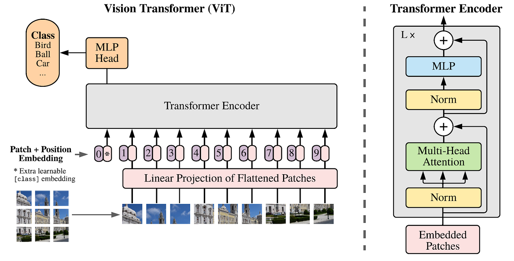
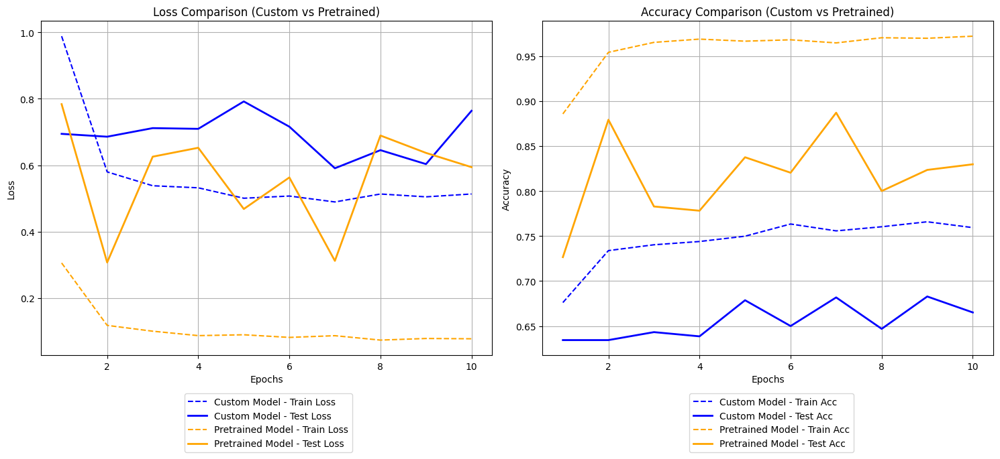
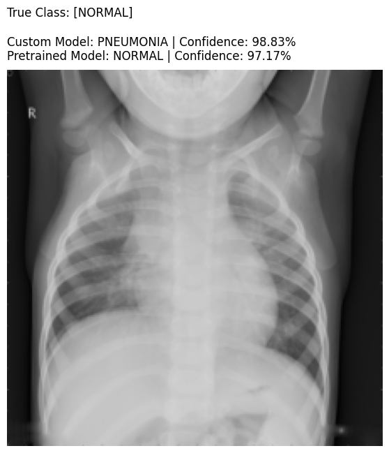

# 🚀 ViT Experiments: Custom vs Pretrained

Evaluating the performance of a custom-built Vision Transformer (ViT) from scratch versus a pretrained ViT model.

## 📖 Introduction & Architecture
This repository is heavily inspired by the groundbreaking paper: **[An Image is Worth 16x16 Words: Transformers for Image Recognition at Scale](https://arxiv.org/abs/2010.11929)**.

Instead of using traditional convolutions, the Vision Transformer (ViT) treats an image as a sequence of fixed-size patches. These patches are linearly projected, flattened, and then fed into a standard Transformer Encoder, similar to how words are processed in NLP tasks.

*(Image Source: Dosovitskiy et al., 2020)*

### ⚙️ ViT-Base (ViT-B/16) Specifications
In these experiments, the models follow the standard **ViT-Base** architecture with a 16x16 patch size. Below are the core structural specifications:

| Parameter | Value | Description |
| :--- | :---: | :--- |
| **Patch Size** | 16x16 | The pixel resolution of each extracted image patch. |
| **Layers** | 12 | Number of sequential Transformer Encoder blocks. |
| **Hidden Size ($D$)** | 768 | The embedding dimension size used throughout the network. |
| **MLP Size** | 3072 | The hidden dimension size of the Multi-Layer Perceptron inside each encoder block. |
| **Attention Heads** | 12 | Number of parallel attention heads within each Multi-Head Attention layer. |
| **Total Parameters** | ~86M | Approximate total number of trainable parameters in the model. |

## 🩺 Project Overview
This repository explores the Vision Transformer (ViT) architecture through hands-on experiments using a medical X-ray dataset (Normal vs Pneumonia). The main objective is to compare the classification accuracy, training efficiency, and convergence speed between two approaches:
1. **Custom ViT:** A Vision Transformer built entirely from scratch using standard PyTorch modules.
2. **Pretrained ViT:** A state-of-the-art Vision Transformer loaded via the `timm` library, fine-tuned on the custom dataset using Transfer Learning.

## 📊 Results & Comparison
After training both models for **10 Epochs**, the superiority of the pretrained model and transfer learning is clearly visible. The pretrained model generalizes much better, while the custom model struggles due to the massive data requirements typical of ViT architectures trained from scratch.

| Metric | Custom ViT (From Scratch) | Pretrained ViT (`timm`) |
| :--- | :---: | :---: |
| **Train Accuracy** | 75.93% | **97.20%** |
| **Test Accuracy** | 66.51% | **82.97%** |
| **Train Loss** | 0.5134 | **0.0775** |
| **Test Loss** | 0.7639 | **0.5942** |

### Performance Graphs
The graphs below illustrate the loss and accuracy over the 10 epochs. The Pretrained model converges significantly faster and achieves much higher accuracy.

### Inference Example
Here is a test prediction showing the difference in pattern recognition between the two models on a test sample:
- **True Class:** NORMAL
- **Pretrained Model:** Correctly predicted NORMAL (97.17% confidence).
- **Custom Model:** Incorrectly predicted PNEUMONIA (98.83% confidence).

